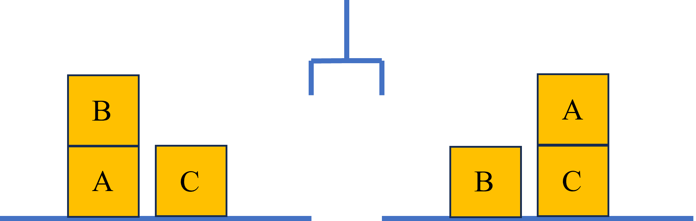
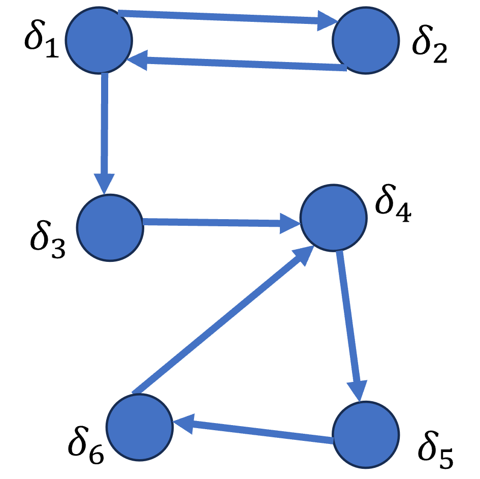
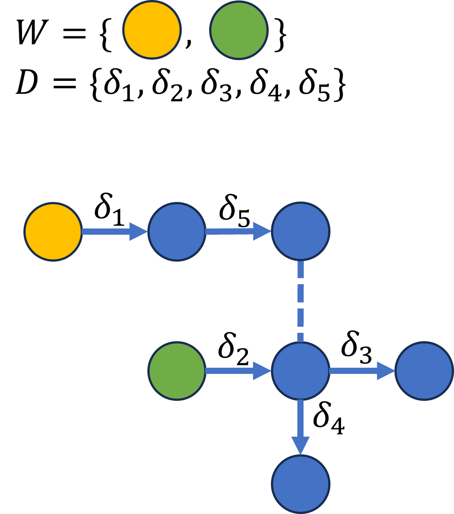
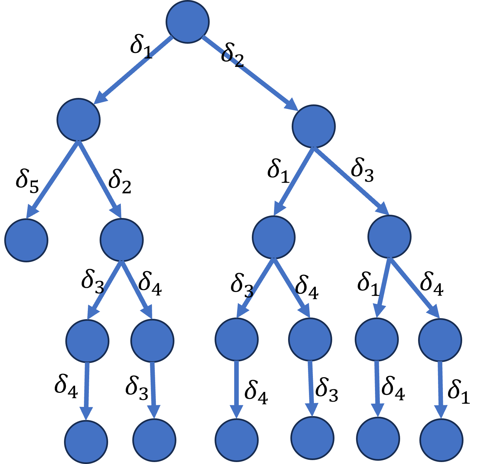

<!-- meta： 
目录，用pdf书签制作，区分经典Classical approaches for dealing with defaults和当代Modern approaches for dealing with defaults

-->

# Default Logic
—— a approach to nonmonotonic reasoning
<!-- default logic 在文献中多翻译为“缺省逻辑”，但“default”也有“默认”的意思，在后面讨论上这两个词混用，意义上不做区分 -->

---

## why default?
<!-- 泛泛地说，缺省逻辑是实现非单调推理的一种途径。具体地，先来分析一下缺省逻辑是在面对什么样的问题下提出来的。首先就是可废止推理，说的是推理规则并不是建立在严格的推演上的，可能在结论与某些已知信息冲突的情况下使规则不再有效，这就需要一个非单调的理论来刻画这种否定推理规则的现象。其次是闭世界推理，一般情况下，我们不知道的远比知道的多，当没有正面的证据支撑某个命题时，我们可以默认认为这个命题是假的。这个问题被提出的时候是用的数据库的例子，当在回答一个查询时，如果在数据库中搜索不到满足查询的记录，可以默认得到否定的结论。最后一个问题来自人工智能领域中的规划问题：标架问题。如果说前面的问题都是比较宏大和思辨的，那标架问题在上世纪70年代算是比较具体和明确的了。 -->
**problems**
- defeasible reasoning
- closed world reasoning
- frame problem

**example*** (Tweety Triangle) Usually (typically) birds fly. Given the information that Tweety is a bird we may conclude that Tweety flies. However if later we get the information that  Tweety is a penguin,  the default becomes inapplicable because we know that penguin can't fly.

---

## frame problem$^1$

机械臂可以拿起一块积木并将其放到另一个位置，可以是放在桌子上，也可以是放在另一块积木上，机械臂一次只能拿起一块积木，因此它无法拿起上面有另一块积木的积木。一个经典的问题如下图展示：

1. this questions were mainly raised by McCarthy and Hayes around 1969. 

---

## frame problem
aim situation: $H[on(A,C), \varphi], H[clear(B), \varphi], H[clear(A), \varphi]$
initial situation: $\Gamma = \{H[on(B,A), s_1], H[clear(B), s_1], H[clear(C), s_1]\}$
axiom schema: $(H[clear(X), s]\land H[clear(Y), s]\land X\neq Y)\rightarrow (H[on(X, Y), Res((stack(X, Y)), s)])$ $(H[on(X, Y), s]\land H[clear(X), s])\rightarrow (H[clear(Y),  Res((unstack(X, Y)), s)])$

$\Gamma\vdash H[on(A,C), Res(\alpha, s_1)], \alpha = (unstack(B, A), stack(A, C))$
- $H[clear(A), s_2], s_2 = Res((unstack(B, A)), s_1)$
- $H[on(A, C), Res((stack(A, C)), s_2)]$
但事实上我们缺少 $H[clear(C), s_2]$，一个可能的解决方法是修改公理模式，使每次动作后未改变的状态继承下来，但是如果积木非常多，公理将变得冗余。

---

## Definition of Default Logic
**syntax**: A default theory is a pair $(W, D)$ consisting of
- $W$: a set of FOL formulae (called facts or axioms) and
- $D$: a countable set of defaults, a default $\delta$ has the form
$$
\frac{\varphi:\psi_1, \psi_2, \cdots, \psi_n}{\chi}
$$
where $\varphi, \psi_1, \psi_2, \cdots, \psi_n$ and $\chi$ are closed FOL formulae and $n > 0$.

**denotation**: $\varphi$ is called the prerequisite (denoted by $pre(\delta)$), $\psi_1, \psi_2, \cdots, \psi_n$ the justifications (denoted by $just(\delta)$), and $\chi$ the consequent of $\delta$ (denoted by $cons(\delta)$). We also use $pre(D) = \{pre(\delta)\ |\ \delta\in D\}$, $cons(D) = \{cons(\delta)\ |\ \delta\in D\}$.

---

## informaly semantics
informaly semantics: 
- if $\varphi$ is known, and if it is consistent to assume that $\psi_1, \cdots, \psi_n$, then conclude $\chi$. 
- $W$ can be seen as the initial information, we could use the rules in $D$ to inferrence more information. 
  
What is special is that the use of one rule can abolish another rule, because the conclusion of one rule may break the justification of another rule. We will use a graph to show this later.

---

## why closed?
$$
\frac{bird(x):flies(x)}{flies(x)}
$$
is not a default according to definition, since the formulae are not closed. We call such “defaults” open defaults. An open default is interpreted as a default schema representing a (possibly infinite) set of defaults. 
$$
\frac{\varphi\sigma:\psi_1\sigma, \psi_2\sigma, \cdots, \psi_n\sigma}{\chi\sigma}
$$
for all ground substitutions $\sigma$ that assign values to all free variables occurring in the schema.

---

## why closed?
each one of the quantifiers is not adequate
$$
\frac{bird(x):flies(x)}{flies(x)}
$$
- universally quantified interpretation as “If all $x$ are birds, and if for all $x$ we may assume that they fly, then we conclude that all $x$ fly.” Useless expect every object in the domain is a bird which does match the intuition.
- existentially quantified interpretation as “If there is a bird and if there is an $x$ that flies, then conclude that there is some flying object.” Would not allow to conclude from $bird(tweety)$ that $flies(tweety)$ holds. instead we would conclude: $\exists x\ flies(x)$

---

## example*
**problems**: defeasible reasoning, closed world reasoning, frame problem
**example** 1. (Nixon Diamond) Nixon is both a Quaker(贵格会) and a Republican(共和党). Usually, quakers are pacifist. Usually, republicans are not pacifist. we have $T=(W,D)$ where
$$
W=\{Q, R\}, D=\{\frac{Q:P}{P}, \frac{R:\neg P}{\neg P}\}
$$
**example** 2. closed world default
$$
\frac{:\neg \varphi(\mathbf{x})}{\neg \varphi(\mathbf{x})}
$$
**example** 3. frame default
$$
\frac{H[\varphi, s]: H[\varphi, Res(\alpha, s)]}{H[\varphi, Res(\alpha, s)]}
$$

--- 
<!-- 为了使 default rules 之间的关系更加直观，介绍一种图对应-->
## graph structure of default rules  [Y. Dimopoulos and A. Torres, 1996]
$$
D=\{\delta_1 = \frac{:B}{B}, \delta_2 = \frac{:\neg B}{\neg B}, \delta_3 = \frac{:C\land \neg B}{C}, \delta_4 = \frac{:E\land \neg G\land \neg C}{E}, \delta_5 = \frac{:F\land\neg E}{F}, \delta_6
 = \frac{:G\land \neg F}{G}\}
$$

Here the graph show the conflict relationship between default rules. When using inference to expand information, after the default rule at the beginning of the arrow is applied, the default rule at the end cannot be used forever. (example* Nixon Diamond)

---

## semantics of defaults (abstract view) [Reiter, 1980]

focus on the informaly semantics of ${\varphi:\psi_1, \psi_2, \cdots, \psi_n}/{\chi}$: if $\varphi$ is known, and if it is consistent to assume that $\psi_1, \cdots, \psi_n$, then conclude $\chi$. The question is that what it is consistent with?

For a default theory $T$, we want to find a set of formulae, which satisfy the following properties, we called this kind set $E$ is a extension of $T$.
- an extension should include the set W of facts—the certain information
- an extension should be deductively closed(classical logic consequence)
- an extension should be closed under the application of the defaults. Apply defaults exhaustively. Formally speaking: if ${\varphi:\psi_1, \psi_2, \cdots, \psi_n}/{\chi} \in D, \varphi \in E$ and $\neg \varphi_1 \notin E, \cdots, \neg \varphi_n \notin E$ then $\chi \in E$.

---

## fixed point of extension

Let default theory $T=(W,D)$, $S$ is a set of formulae, define $\Lambda_T(S)$ is the least (minimal) set of formulae that satisfy $^1$
- $W \subseteq \Lambda_T(S)$, 
- $Th(\Lambda_T(S)) = \Lambda_T(S)$, 
- $\forall ({\varphi:\psi_1, \psi_2, \cdots, \psi_n}/{\chi}) \in D, \text{ if }\varphi \in \Lambda_T(S)$ and $\neg \varphi_1 \notin S, \cdots, \neg \varphi_n \notin S$ then $\chi \in \Lambda_T(S)$

**Definition** (extension), A set $E$ is an extension of default theory $T$ if and only if $E=\Lambda_T(E)$.

1. we should know that the set of default rules $D$ should be consistent. for example, $\varphi:\psi/\chi$ and $\varphi:\psi/\neg\chi$ can not be both in $D$.

---

## property of extension
<!-- 接下来要考虑这些 E 具有什么确定的性质。 -->
**Corollary** 1. (Minimality of Extensions) If $E$ and $E'$ are extensions for a closed
default theory $(D,W)$ and if $E'\subseteq E$, then $E' = E$.
**Theorem** 2. (Consistency preservation) A default theory $T=(W,D)$ has an inconsistent extension iff $W$ is inconsistent.
**Corollary** 3. if a default has an inconsistent extension $E$, then it is its only extension.
**Theorem** 4. Let $T=(W,D)$ be a default theory s.t. the set $M = W\cup \{\psi_1 \land \cdots \land \psi_n \land \chi\ |\ \varphi : \psi_1,\cdots,\psi_n/\chi \in D\}$ is consistent. Then $T$ has exactly one extension.

---

## example* 
Nixon Diamond: $T=(W,D)$ where
$$
W=\{Q, R\}, D=\{\frac{Q:P}{P}, \frac{R:\neg P}{\neg P}\}
$$
There are two extension $\{Q,R,P\}$ and $\{Q,R,\neg P\}$

Toward complex: 
$$
D=\{\delta_1 = \frac{:B}{B}, \delta_2 = \frac{:\neg B}{\neg B}, \delta_3 = \frac{:C\land \neg B}{C}, \delta_4 = \frac{:E\land \neg G\land \neg C}{E}, \delta_5 = \frac{:F\land\neg E}{F}, \delta_6
 = \frac{:G\land \neg F}{G}\}
$$
When the default rules is complex, how to find all extension of a default theory?

---

## operational semantics of default logic [G. Antoniou and V. Sperschneider, 1994]

Given a default theory $T = (W,D)$ let $\Pi= (\delta_0, \delta_1, \cdots)$ be (a finite or infinite) sequence of defaults from $D$ without multiple occurrences. (Possible order in which some defaults from D are applied.) $\Pi[k]$ denotes the initial segment of sequence $\Pi$ of length $k$.
Each sequence $\Pi$ is associated with two sets: $In(\Pi)$ and $Out(\Pi)$
- $In(\Pi) = Th(W\cup \{cons(\delta)\ |\ \delta\ in\ \Pi\})$ represents the current knowledge base after the defaults in $\Pi$ have applied. (ordinary logical consequence $Th(\Sigma) = \{X:\Sigma \vdash X\}$)
- $Out(\Pi) = \{\neg \psi\ |\ \psi\in just(\delta)\ for\ \delta\ in\ \Pi\}$ represents the formulae that should not become true even after subsequent application of other defaults.

---

## process and applicable
example* Let $T = (W,D)$ where $W = \{a\}$ and
$$
D = \{\delta_1 = \frac{a:\neg b}{\neg b}, \delta_2 = \frac{b:c}{c}\}.
$$
we have $In((\delta_1)) = Th(\{a, \neg b\})$, $Out((\delta_1)) = \{b\}$ and $In((\delta_2, \delta_1)) = Th(\{a, c, \neg b\})$, $Out((\delta_2, \delta_1)) = \{\neg c, b\}$. but $\Pi = (\delta_2)$ connot be applied, since $b\notin In(()) = Th(W) = Th(\{a\})$
Generally, $\Pi$ is called a process of $T$ iff for every $\delta_k$ in $\Pi$, $pre(\delta_k)\in In(\Pi[k])$, called $\delta_k$ is applicable to $\Pi[k]$.

---

## successful (failed), closed and extension
Let $\Pi$ be a process. We define:
- $\Pi$ is successful iff $In(\Pi) \cap Out(\Pi) = \emptyset$. Otherwise, it is failed.
- $\Pi$ is closed iff every $\delta\in D$ that is applicable to $In(\Pi)$ already occurs in $\Pi$.
- Let $T$ be a default theory. A set of formulae $E$ is an extension of $T$ iff there is some closed and successful process $\Pi$ s.t. $E = In(\Pi)$.

**Theorem** (identity) Let $T = (W,D)$ be a default theory. $E$ is an extension of $T$ (according the definition of operational semantics) iff $E = \Lambda_T(E)$.

---

## example*

$T = (W,D)$ where $W = \{a\}$ and
$$
D = \{\delta_1 = \frac{a:\neg b}{d}, \delta_2 = \frac{: c}{b}\}.
$$
$\Pi_1 = (\delta_1)$ is successful, but not closed, since $\delta_2$ may be applied to $In(\Pi_1) = Th(\{a, d\})$.
$\Pi_2 = (\delta_1, \delta_2)$ is closed, but not successful, since both $In(\Pi_2) = Th(\{a, b, d\})$ and $Out(\Pi_2) = \{b, \neg c\}$ contain $b$. (the same to $\Pi_2' = (\delta_2, \delta_1)$)
$\Pi_3 = (\delta_2)$ is a closed and successful process of $T$. So $E=In((\delta_2)) = Th(\{a, b\})$ is  an extension of $T$, in fact its single extension.

---
<!-- 正常该考虑证明论，但是一般情况下的证明论是十分复杂的，这里先引入更简单的情况，normal default -->
## normal default
A default is normal iff its consequent is its only justification. They have the form
$$
\frac{\varphi:\psi}{\psi}
$$
A default theory $T = (W,D)$ is normal iff all defaults in $D$ are normal. (sometimes $\varphi:\psi/\psi$ write as $\varphi\rightarrow\psi$ for simplify)
Normal defaults are well-behaved
- always have extensions
- rule out "pathological cases" such as: $:a/\neg a$
- have limited expressivity: no interactions among defaults

---

## forward tree
Each normal default theory $T = (W,D)$ can define a directed graph $G=(V,E)$, where  $V=pre(D)\cup cons(D), E=\{(pre(\delta), cons(\delta))\ |\ \delta\in D\}$. And use a dotted line to indicate inconsistency between the two formulas.

<!-- generally, each default theory can define a tree.
- different process may be get the same extension, which there are some redundancy on the operational semantic. We will remove the order of the defaults to get a briefly scenario semantics by F. Horty. (not sure)
- though there may be circle on the graph, but only once occer of default adimited on the process. -->
<!-- 向前搜索有冗余的话，一个自然的想法是反向搜索 -->

---

## backward proof theory

A default proof of $\varphi$ in a normal default theory $T = (W, D)$ is a finite sequence $(D_0, D_1, ... , D_k)$ of subsets of $D$ such that
- $\varphi$ follows from $W\cup cons(D_0)$ ;
- for all $i<k$, the prerequisited of defaults in $D_i$ follow from $W\cup cons(D_{i+1})$ ;
- $D_k = \emptyset$ ;
- $W\cup cons(\bigcup_i D_i)$ is consistent.

**Theorem** 1. A formula $\varphi$ has a default proof in a normal default theory $T$ iff there is an extension $E$ of $T$ such that $\varphi\in E$.

---

## property of normal closed default
**Lemma** 1. Each process of a normal default theory is successful.
proof: 
**Theorem** 2. Normal default theories (with a consistent set of facts W) always possess extensions. Every finite process $\Pi$ may be expanded to a closed process $\Pi'$.
**Theorem** 3. (Semi-monotonicity). Let $T = (W,D)$ and $T' = (W,D')$ be normal default theories where $D \subseteq D'$. Then each extension of $T$ is contained in an extension of $T'$.

---

## nonmonotonic reasoning
classical consequence
<!-- - Inclusion alias Reflexivity: $A\subseteq Th(A)$
- Cumulative Transitivity, CT alias Cut: $A\subseteq B\subseteq Th(A)$ implies $Th(B)\subseteq Th(A)$ -->
- Monotony: whenever $A\subseteq B$ then $Th(A)\subseteq Th(B)$

Default Logic as a approach to nonmonotonic reasoning
- high level theory but not underlying logic, exactly a default theory $T=(W,D)$ is defined by a set of defaults $D$ (exactly a set of inference rules) and a set of formulaes $W$ based on the underling logic. So when the set $W$ is variable,  we expect the nonmonotonic reasoning to appear.
- We can understand $W$ as a knowledge state, $D$ as specially inference rules(opposite to inference schema) and the extension $E$ as the set of beliefs that can be accepted in that state of knowledge. When $W$ is expanded, we hope that some belief sets will disappear and some new belief sets will appear. The following **theorem** will capture this intuition.

---

## variable $W$

**Theorem**. Let $E$ be an extension of the default theory $T=(W,D)$. Then $E$ is also an extension of $T'=(W\cup W',D)$ for every subset $W'$ of $E$.

an example from [W. Marek and M. Thuszczynski, 1993]: $T = (W,D)$ where $W = \emptyset$ and
$$
D = \{\frac{:\neg b, \neg d}{a}, \frac{: \neg b, \neg d}{c}, \frac{:\neg a, \neg c}{d}, \frac{a:\neg c}{b}\}.
$$
$T$ have two extension $E_1 = Th(\{a,c\}), E_2=Th(\{d\})$. Consider the subset $W' = \{a\}$ of $E_1$. The default $T'=(\{a\},D)$ has two extensions: $E_1$ as predicted by **theorem** aboved and $E_3 = Th(\{a,b\})$ which is completely unrealted to $E_2$. As knowledge expanded, previous beliefs set $E_2$ are abandoned and new beliefs set $E_3$ are admitted.

---

## dealing with conflicts
**Theorem** 1. (Orthogonality of Extensions). Let $E$ and $F$ be different extensions of a normal default theory $T$ Then $E\cup F$ is inconsistent.
**Corollary** 2.  Let $E$ and $F$ be two extensions of a normal default theory $T$, if $E\cup F$ is consistent. then $E=F$. This is consistent with intuition. Consistent beliefs should be put together to form a unique belief set.
but when we have conflicts beliefs set, which one should we choose to expand the state of knowledge?
- reasoning types such as the Credulous and the Skeptical reasoning types
- conflict resolution principles such as the Specificity Principle (Tweety bird) or other measures of argument strength (priority [G. Brewka, 1994])

---

## reasons as defaults [John F. Horty, 2007]
Recall the operational semantics of default theories, it is the order of the process that produce the redundancy. So in the scenario semantics of default theories, a scenario based on a default theory $T$ is defined simply as some subset $S$ of the set $D$. We can say that the belief set $\mathcal{E}$ is generated by that scenario $S$ where $\mathcal{E} = Th(W\cup cons(S))$. Not every scenario based on a default theory is intuitively acceptable, the central task is to characterize the proper scenarios. So on the operational semantics of default theories, theoretically there are $n!$ possible process need to check, but on the scenario semantics there are $2^n$ possible scenarios need to check.

**Fixed priority default theories**: A fixed priority default theory $T$ is a structure of the form $(W,D,<)$ , in which $W$ is a set of ordinary propositions, $D$ is a set of normal default rules, and $<$ is a strict partial ordering on $D$.

---

## Triggered defaults, Conflicted defaults, and Defeated defaults

**Definition 1** (Triggered defaults) Where $S$ is a scenario based on the fixed priority default theory $T = (W,D,<)$, the defaults from $D$ that are triggered in $S$ are those belonging to the set
$$
\begin{align*}
    Triggered_{T}{(S)} = \{\delta\in D |\ W\cup cons(S) \vdash pre(\delta)\}
\end{align*}
$$

**Definition 2** (Conflicted defaults) Where $S$ is a scenario based on the fixed priority default theory $T = (W,D,<)$, the defaults from $D$ that are conflicted in $S$ are those belonging to the set
$$
\begin{align*}
    Conflicted_{T}{(S)} = \{\delta\in D |\ W\cup cons(S) \vdash \neg cons(\delta)\}
\end{align*}
$$

**Definition 3** (Defeated defaults: preliminary definition) Where $S$ is a scenario based on the fixed priority default theory $T = (W,D,<)$, the defaults from $D$ that are defeated in $S$ are those belonging to the set
$$
\begin{align*}
    Defeated_{T}{(S)} = \{\delta\in D |\ \exists\delta'\in Triggered_{T}{(S)}\ s.t.\ \delta<\delta'\ and\ cons(\delta') \vdash \neg cons(\delta)\}
\end{align*}
$$

---

## Binding defaults and Proper scenarios

**Definition 4** (Binding defaults) Where $S$ is a scenario based on the fixed priority default theory $T = (W,D,<)$, the defaults from $D$ that are binding in $S$ are those belonging to the set
$$
\begin{align*}
    Binding_{T}{(S)} = \{\delta\in D |\ \delta\in Triggered_{T}{S}, \delta\notin Conflicted_{T}{S}\ and\ \delta\notin Defeated_{T}{S},  \}
\end{align*}
$$ 

**Definition 5** (Proper scenarios: preliminary definition) Let $S$ be a scenario based on the ordered default theory $T=(W,D,<)$. Then $S$ is a proper scenario based on $T$ just in case $S = Binding_T(S)$.

**Definition 6** (Extension) Let $T=(W,D,<)$ be a fixed priority default theory, then $\mathcal{E} = Th(W\cup cons(S))$ is an extension of $T$ when the scenario $S$ is a proper scenario based on $T$.

---

## why variable priority?
Because we reason about our own reasons, offering further reasons for taking some of our reasons more seriously than others, and still further reasons for evaluating those.
We enrich the underling language to enable formal reasoning about priorities among default rules: 
- each form $d_x$ is a constant refers to the default $\delta_x$, called the name of the default.
- a binary relation (predicate) $\prec$, representing the priority among defaults. 
- the set $W$ need contain each possible instance of the irreflexivity and transitivity schemate: $\neg(d\prec d), (d\prec d'\land d'\prec d'') \rightarrow d\prec d''$ where the variables are replaced with names of the defaults belonging to $D$.

<!-- example* Nixon Diamond: $W = \{Q, R, \neg(d_1\prec d_1), \neg(d_2\prec d_2), \neg(d_3\prec d_3)\}, D=\{\delta_1, \delta_2, \delta_3\}, where\ \delta_1 = Q\rightarrow P, \delta_2 = R\rightarrow \neg P, \delta_3 = \top\rightarrow d_1\prec d_2$. (simplify $\varphi:\psi/\psi$ to $\varphi\rightarrow\psi$) Thus the only proper scenario is $\{\delta_2, \delta_3\}$. -->

---

## variable priority default theory
The default $\delta'$ has a higher priority than $\delta$ according to the scenario $S$ defined as follow:
$$
\delta<_S\delta' \text{ iff } W\cup cons(S)\vdash d\prec d'
$$
Because the set $W$ contains all instances of transitivity and irreflexivity, the derived priority relation $<_S$ is guaranteed to be a strict partial ordering.
**Definition** (Proper scenarios) Let $T = (W,D)$ be a variable priority default theory and $S$ a scenario. Then $S$ is a proper scenario based on $T$ if and only if S is a proper scenario based on the fixed priority default theory $(W,D,<_S)$.

**example*** Nixon Diamond: $W = \{Q, R\}$, and $\delta_1 = Q\rightarrow P$, $\delta_2 = R\rightarrow \neg P$, $\delta_3 = \top\rightarrow d_1\prec d_2$, $\delta_4 = \top\rightarrow d_2\prec d_1$, $\delta_5 = \top\rightarrow d_4\prec d_3$. If $D=\{\delta_1, \delta_2\}$, there are two proper scenarios: $\{\delta_1\}, \{\delta_2\}$. If $D=\{\delta_1, \delta_2, \delta_3\}$, there are the  only proper scenario is $\{\delta_2, \delta_3\}$. If $D=\{\delta_1, \delta_2, \delta_3, \delta_4\}$, there are two proper scenarios: $\{\delta_1, \delta_4\}, \{\delta_2, \delta_3\}$. If $D=\{\delta_1, \delta_2, \delta_3, \delta_4, \delta_5\}$, there are the  only proper scenario is $\{\delta_2, \delta_3, \delta_5\}$.

---

## relavent

practical and epistemic reasons
- deontic logic and legal
- belife revison

argumentation theory
default justification logic
causal reasoning

---

## referrence

[Reiter, 1980] R. Reiter, A logic for default reasoning, Artificial Intelligence, Volume 13, Issues 1–2, 1980, Pages 81-132, ISSN 0004-3702, https://doi.org/10.1016/0004-3702(80)90014-4.
[W. Marek and M. Thuszczynski, 1993] W. Marek and M. Thuszczynski. Nonmonotonic Logic. Springer 1993.
[G. Antoniou and V. Sperschneider, 1994] G. Antoniou and V. Sperschneider. Operational Conce pts of Nonmonotoni c Logics . Part 1: Default Logic. Artificial Intelligence Review 8(1994): 3-16.
[G. Brewka, 1994] G. Brewka, Reasoning about Priorities in Default Logi c. In th e Proceedings of the 12th National Conference on Artificial Intellig ence (AAAI-94), 940-945. AAAI/MIT Press 1994.

---

## referrence

[Y. Dimopoulos and A. Torres, 1996] Yannis Dimopoulos, Alberto Torres, Graph theoretical structures in logic programs and default theories, Theoretical Computer Science, Volume 170, Issues 1–2, 1996, Pages 209-244, ISSN 0304-3975, https://doi.org/10.1016/S0304-3975(96)80707-9. 
[G. Antoniou, 1997] Grigoris Antoniou. Nonmonotonic Reasoning, Artificial Intelligence, Cambridge, MA: The MIT Press, 1997. ISBN:0-262-01157-3.
[Strasser, Christian and G. Aldo Antonelli, 2001] "Non-monotonic Logic", The Stanford Encyclopedia of Philosophy (Summer 2019 Edition), Edward N. Zalta (ed.), URL = <https://plato.stanford.edu/archives/sum2019/entries/logic-nonmonotonic/>.
[Horty, 2001] Horty, John F. (2001). Nonmonotonic Logic. In Lou Goble (ed.), The Blackwell Guide to Philosophical Logic. Oxford, UK: Blackwell. pp. 336–361.

---

## referrence

[Makinson, 2005] David Makinson, HOW TO GO NONMONOTONIC, Handbook of Philosophical Logic, Volume 12, 175–278.
[Horty, 2007] Horty, John (2007). Reasons as Defaults. Philosophers' Imprint 7:1-28.
[Horty, 2012] Reasons as Defaults by John F. Horty . Oxford :  Oxford University Press ,  2012