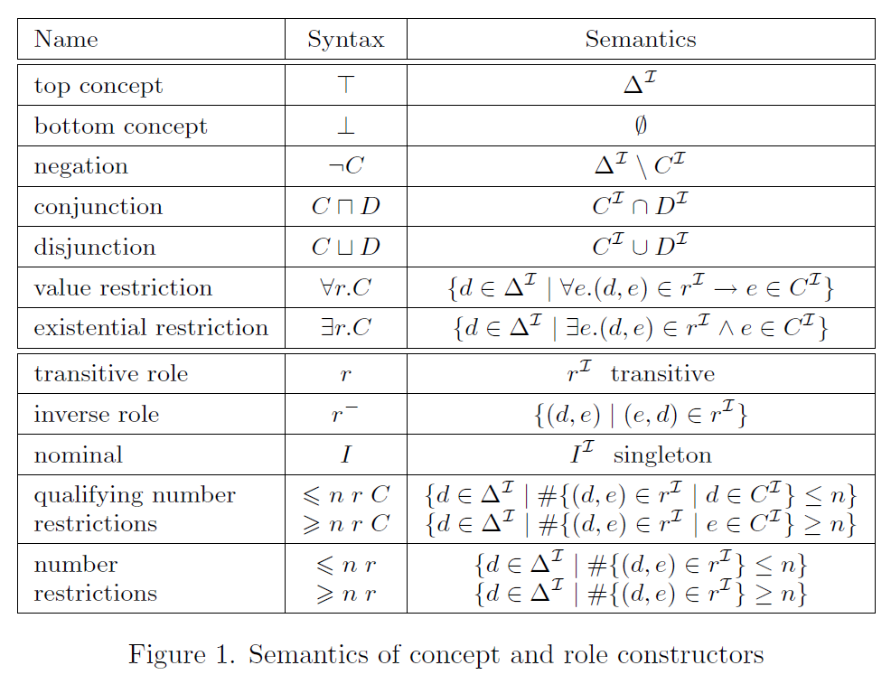
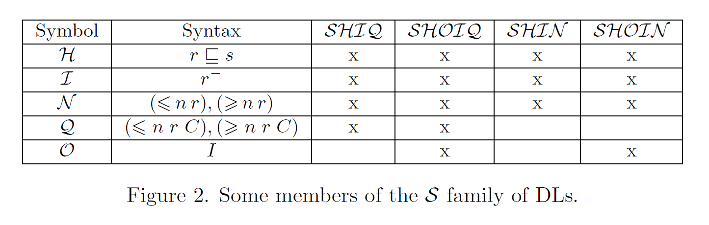

# 2 定义

论域必须是非空的，可以是无穷集合。论域中的元素称为实例（instance）。

**概念名称（concept name）**：类名，外延是论域的有限子集，可以看作一元谓词。

**作用名称（role name）**：关系名，表示论域中的二元关系，可以看作二元谓词。

**概念描述（concept description）**：用概念名称和作用名称按照语法规则构成的句子，表示对一些实例的抽象描述/刻画。

**概念定义（defined concept）**：将概念描述定义为一个概念名称。

**专名（nominal concept）**：外延只有一个元素的概念名称。

**个体名称（individual name）**：个体名，只能出现在 $ABox$ 中，表示论域中的单个元素。

**实例断言（instance assertion）**：断言一个个体名称是一个概念名称的实例。

**概念模型（concept patterns）**：含有变量的概念描述。

“ role ”为何翻译为“作用”？

role 有人直译为“角色”，有人更一般的翻译为“关系”，而“作用”是更恰当的翻译。理由如下，在大英百科全书中 role 有词条：“a function or part performed especially in a particular operation or process”，其中 function 可以翻译为作用，另外， role 本质上是算子，算子就是作用于对象之上的，因此，role 翻译为“作用”更为恰当。

## 2.1 $\mathcal{ALC}$

$\mathcal{ALC}$ 是带补语的定语语言（Attributive Language with Complements），由 Schmidt-Schauß 和 Smolka 在 1991 年提出，是基本的描述逻辑语言。

### 2.1.1 $\mathcal{ALC}$ 的语法(Syntax)

$$\begin{align}
& \textbf{定义 }(\mathcal{ALC}语言) 记 \, \mathbf{C} \, 为概念名称的集合，\, \mathbf{R} \, 为作用名称的集合，\,\mathbf{C}\, 与 \,\mathbf{R}\, 不相交。\,\mathcal{ALC}\, \\
& 的概念描述集合递归定义如下：\\
& \bullet 所有的概念名称是 \,\mathcal{ALC}\, 概念描述。\\
& \bullet \top 和 \bot 是 \,\mathcal{ALC}\, 概念描述。\\
& \bullet 如果 \,C\, 和 \,D\, 是 \,\mathcal{ALC}\, 概念描述，并且 \,r\, 是一个作用名称，那么下面的也是 \,\mathcal{ALC}\, 概念描述：\\
& \qquad \,C\, \sqcap \,D\, (合取)，\\
& \qquad \,C\, \sqcup \,D\, (析取)，\\
& \qquad \neg \,C\, (非)，\\
& \qquad \exists r . C\, (存在约束)，\\
& \qquad \forall r . C\, (全称约束)。\\
\end{align}$$

### 2.1.2 语义(Semantic)

$$
\begin{align}
& \textbf{定义 }一个解释 \mathcal{I} = (\Delta^{\mathcal{I}}, \cdot^{\mathcal{I}}) 是由一个非空集合论域 \Delta^{\mathcal{I}} 和一个映射 \cdot^{\mathcal{I}} 构成，\\
& 其中映射定义如下：\\
& \bullet 每一个概念名称 A \in \mathbf{C} 都映射到一个集合 A^{\mathcal{I}} \subseteq \Delta^{\mathcal{I}}。\\
& \bullet 每一个作用名称 r \in \mathbf{R} 都映射到一个二元关系 r^{\mathcal{I}} \subseteq \Delta^{\mathcal{I}} \times \Delta^{\mathcal{I}}\\ 
\end{align}
$$

映射 $\cdot^{\mathcal{I}}$ 可以扩展到 $\top, \bot$ 以及复杂概念中：

$$
\begin{align}
    \top^{\mathcal{I}} & = \Delta^{\mathcal{I}},\\
    \bot^{\mathcal{I}} & = \emptyset,\\
    (C \sqcap D)^{\mathcal{I}} & = C^{\mathcal{I}} \cap D^{\mathcal{I}},\\
    (C \sqcup D)^{\mathcal{I}} & = C^{\mathcal{I}} \cup D^{\mathcal{I}},\\
    (\neg C)^{\mathcal{I}} & = \Delta^{\mathcal{I}} \setminus C^{\mathcal{I}},\\
    (\exists r . C)^{\mathcal{I}} & = \{ d \in \Delta^{\mathcal{I}} | 存在一个 e \in C^{\mathcal{I}} ，使得 (d,e) \in r^{\mathcal{I}} \},\\
    (\forall r . C)^{\mathcal{I}} & = \{ d \in \Delta^{\mathcal{I}} | 对于每一个 e \in \Delta^{\mathcal{I}} ，如果 (d,e) \in r^{\mathcal{I}} 那么 e \in C^{\mathcal{I}} \}。\\
\end{align}
$$

!!! Tips
    在计算机的字符串模式匹配中，" . " 表示匹配任何单个字符，例如用模式 "<.>" 就能匹配 "fne<f\>oej<g\>ihu<o\>aeu" 得到 {f,g,o} 。这里 $\exists r . C$ 和 $\forall r . C$ 可以看作作用在论域 $\Delta^{\mathcal{I}}$ 上的模式匹配。

<!-- $(rDE)^{\mathcal{I}} = \{ (d,e)\ |\ d \in D,e \in E \textrm{ and } r(d,e) \}$

$(r.E)^{\mathcal{I}} = \{ (d,e)\ |\ d \in \Delta^{\mathcal{I}},e \in E \textrm{ and } r(d,e) \}$

$(r..)^{\mathcal{I}} = \{ (d,e)\ |\ r(d,e), d,e \in \Delta^{\mathcal{I}} \}$ -->

通常，将 $C^{\mathcal{I}}$ 读作概念名称 $C$ 在解释 $\mathcal{I}$ 中的外延 ($extension$)，若 $C^{\mathcal{I}} \neq \emptyset$ ，则称解释 $\mathcal{I}$ 是概念描述 $C$ 的一个模型。
<!-- 若 $b \in \Delta^{\mathcal{I}}, (a,b) \in r^{\mathcal{I}}$，则将 $b$ 称作 $a$ 在解释 $\mathcal{I}$ 下的$\,\textit{r-filler}$。 -->

### 2.1.3 有向标记图(Directed Labeled Graph)

一个解释可以自然的用一个有向标号图来表示，其中每个节点表示一个概念名称，每个边表示一个作用名称。例如：

对应如下的解释：

$$
\begin{align}
    \Delta^{\mathcal{I}} & = \{ t, c1, c2, Aristotle \},\\
    Teacher^{\mathcal{I}} & = \{ t \},\\
    Course^{\mathcal{I}} & = \{ c1, c2\},\\
    Person^{\mathcal{I}} & = \{ Aristotle \},\\
    teaches^{\mathcal{I}} & = \{ (t,c1), (t,c2) \},\\
    attends^{\mathcal{I}} & = \{ (Aristotle, c1) \}.\\
\end{align}
$$

### 2.1.4 $\mathcal{ALC}$ 是多模态逻辑

描述逻辑 $\mathcal{ALC}$ 是多模态逻辑 $\mathcal{K}_{(m)}$ 的变体是由 Schild 于 1991 发现的 $^{[1]}$ 。概念名称看作命题，作用名称看作可通达关系。 $\mathcal{ALC}$ 的解释就是一个克里普克结构，其中 $\Delta^{\mathcal{I}}$ 是世界集，$\cdot^{\mathcal{I}}$ 既提供世界集上的可通达关系集又给出对命题的赋值。于是基于可通达关系 $r$ ，全称约束 $\forall r.C$ 成为 $\Box_r C$ ，存在约束 $\exists r.C$ 成为 $\lozenge_r C$ 。将 $\mathcal{ALC}$ 翻译到一阶逻辑（FOL）的通常方法也和模态逻辑的标准翻译一致。

### 2.1.5 $\mathcal{SHOIQ}$ $^{*}$

$\mathcal{SHOIQ}$ 的重要性源于它（及其片段）在描述逻辑的两个最有影响力的应用领域中的使用：关于概念数据库模型的推理和语义网中的推理。在后一种应用中， $\mathcal{SHOIQ}$ 的片段对应于 W3C（World Wide Web Consortium） 推荐的标准 Web 本体语言 OWL-DL 。

!!! Other
    The **World Wide Web Consortium (W3C)** is the international organization dedicated to the development of HTML and other related languages ​​used in the creation of websites. In just 25 years, W3C has enabled, thanks to its standards, the emergence of an open, interoperable and accessible Web for everyone, everywhere: HTML, CSS and more than 400 other Web technologies on which all websites are based, and which consolidate the entertainment, communications, digital publishing and even finance industries.

### 2.1.6 $\mathcal{AL}$ 家族 $^{*}$

$\mathcal{AL}\ :\ C,D \longrightarrow A\ |\ \top\ |\ \bot\ |\ \neg A\ |\ C \sqcap D\ |\ \forall r.C\ |\ \exists r.\top$

<!-- 作者是在研究可判定性和计算复杂度时做出这种区分的，即在我跳过的那一节，我没看懂这一节-->
!!! Question
    疑问：$\exists r.$ 和 $\forall r.$ （以及 $\sqcap$ 和 $\sqcup$）是对偶算子，为何会影响[可判定性和计算复杂度](../../description_logic/complexity)？
<!-- 需要再次明确问题，防止提出错误的问题 -->

## 2.2 知识库 $KB$

知识库 $KB = (TBox, ABox)$

### 2.2.1 $TBox$（Terminological Formalisms）

通常的定义是：一个 $TBox\ \mathcal{T}$ 是形如 $A \equiv C$ 的概念定义的有限集合，其中 $A$ 是概念名称， $C$ 是概念描述，并且同一个 $A$ 在 $\mathcal{T}$ 中只出现一次。这时， $A$ 称作 $\mathcal{T}$ 中的原始概念。

- 如果概念名称 $B$ 在 $C$ 中出现，则称 $A$ 直接使用 $B$ ，将"使用"理解为"直接使用"的传递闭包。
- 若 $\mathcal{T}$ 中存在一个原始概念使用了它本身，则称 $\mathcal{T}$ 含有循环（或一般的 $\mathcal{T}$），否则称为无环的 $\mathcal{T}$ 。

!!! Example
    $Human \equiv Adam \sqcup Eve \sqcup \exists parent.Human$ 就是含有循环的定义

#### 2.2.1.1 无环 $TBox$ 的模型：

- 如果 $A^{\mathcal{I}} = C^{\mathcal{I}}$ 则解释 $\mathcal{I}$ 满足概念定义 $A \equiv C$ 。
- 如果解释 $\mathcal{I}$ 满足 $TBox\ \mathcal{T}$ 中的所有概念定义，则解释 $\mathcal{I}$ 是 $\mathcal{T}$ 的模型。

#### 2.2.1.2 一般的 $TBox$ 的模型：

- general concept inclusion axioms (GCIs)： $GCI$ 是形如 $C \sqsubseteq D$ 的形式，其中 $C,D$ 都是（复合）概念描述。 $GCI$ 也是 $TBox$ 中的元素。

- 如果 $C^{\mathcal{I}} \subseteq D^{\mathcal{I}}$ 则解释 $\mathcal{I}$ 满足 $C \sqsubseteq D$ 。
- 如果解释 $\mathcal{I}$ 满足 $A \sqsubseteq C,\ C \sqsubseteq A$ 则解释 $\mathcal{I}$ 满足概念定义 $A \equiv C$ 。
- 如果解释 $\mathcal{I}$ 满足 $TBox\ \mathcal{T}$ 中的所有概念定义，则解释 $\mathcal{I}$ 是 $\mathcal{T}$ 的模型。

!!! Example
    $Person \sqcap \exists uncle.Father \sqsubseteq \exists cousin.Person$ 表示：如果一个人的叔叔为人父，那这个人有表兄妹。

!!! Notes
    $\mathcal{T}$ 可以归结为有限个 $GCI$ 构成的集合。
    
    解释 $\mathcal{I}$ 是蕴含式 $C \rightarrow D$ 的模型当且仅当 $\mathcal{I}$ 满足 $C \sqsubseteq D$。理解为：所有的 $C$ 都是 $D$ 。

    用描述逻辑表示三段论：大前提： $C \sqsubseteq D$ ；小前提： $C(a)$ ；结论： $D(a)$

#### 2.2.1.3 $TBox$ 和模态逻辑的关系 $^{*}$

$$
C_{\mathcal{T}} := \forall U. \bigsqcup_{D \sqsubseteq E \in \mathcal{T}} \neg D \sqcup E
$$

其中， $\mathcal{T}$ 是由 $GCIs$ 构成的集合， $U^{\mathcal{I}} = \Delta^{\mathcal{I}} \times \Delta^{\mathcal{I}}$ ，于是 $C_{\mathcal{T}}^{\mathcal{I}} := \Delta^{\mathcal{I}}$

!!! Question
    为何不是

    $$
    C_{\mathcal{T}} := \forall U. \bigsqcup_{D \sqsubseteq E \in \mathcal{T}} E
    $$

    这样定义的话，如果解释 $\mathcal{I}$ 满足 $C_{\mathcal{T}}$ 则也满足 $\mathcal{T}$ 。

    作者提到和 universal modality 有关。

### 2.2.2 $ABox$（assertional formalism）

设有可数无穷个个体名称 $a,b,c$ 等等， $ABox$ 是形如 $C(a),\ r(a,b)$ 的断言的有限集合，其中 $C$ 是概念描述， $r$ 是作用描述。

- 对每个个体 $a$ 解释为 $a^{\mathcal{I}} \in \Delta^{\mathcal{I}}$ ，通常遵守唯一名称假设（ $a \neq b 蕴含 a^{\mathcal{I}} \neq b^{\mathcal{I}}$ ）。
- 如果 $a^{\mathcal{I}} \in C^{\mathcal{I}}$ 则解释 $\mathcal{I}$ 满足概念断言 $C(a)$ 。
- 如果 $(a^{\mathcal{I}},b^{\mathcal{I}}) \in r^{\mathcal{I}}$ 则解释 $\mathcal{I}$ 满足作用断言 $r(a,b)$ 。
- 如果解释 $\mathcal{I}$ 满足 $ABox\ \mathcal{A}$ 中的所有断言，则解释 $\mathcal{I}$ 是 $\mathcal{A}$ 的模型。

$ABox$ 和模态逻辑的关系 $^{*}$

$$
C_\mathcal{A} := \sqcap_{D(a)\in\mathcal{A}} \Big( \exists u.(a\sqcap D) \Big) \sqcap \sqcap_{r(a,b)\in\mathcal{A}} \Big( \exists u.(a\sqcap \exists r.b) \Big)
$$

其中 $u^{\mathcal{I}} = \Delta^{\mathcal{I}} \times \Delta^{\mathcal{I}}$ ，并且假设每个个体名都存在一个同名的名词（nominals）。于是任意一个 $C_{\mathcal{A}}$ 的模型也是 $\mathcal{A}$ 的模型。事实上名词比 $ABox$ 具有更强的表达力。 

### 2.2.3 用知识库 KB 刻画语义模型 $^{*}$

In another area of DL research, its model theory, we investigate which kinds of semantic structure, i.e., interpretations or models, we can describe in a KB $^{[2]}$. 

## 参考文献

- [1] Klaus Schild. A correspondence theory for terminological logics: Preliminary report. In Proc. of the 12th Int. Joint Conf. on Artificial Intelligence (IJCAI’91), pages 466–471, 1991.
- [2] Franz Baader, Ian Horrocks, Carsten Lutz, Uli Sattler - An Introduction to Description Logic - Cambridge University Press (2017). 3.
- [3] Manfred Schmidt-Schauß and Gert Smolka. Attributive concept descriptions with complements. Artificial Intelligence, 48(1):1–26, 1991.