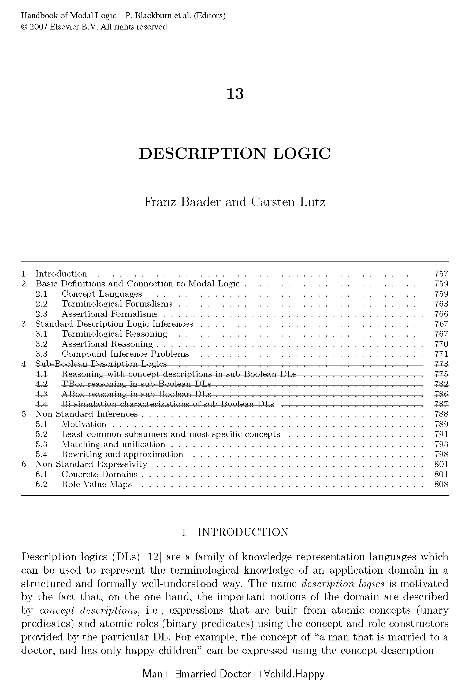

# 引导
描述逻辑（Description Logics，简称DLs）是一族知识表示（knowledge representation）语言，用来以结构化和易读的方式表示知识。

<!-- 整个知识分为几个层面，知识层、构建层、直观层、例子层，构建层在这个文档中声明了，知识层是向抽象、向哲学的思考，直观层更加贴合应用，例子层更容易实在的把握 -->

描述逻辑通常将知识分为两个部分：一个称为TBox（Terminological Box）的术语部分，以及一个称为ABox（Assertional Box）的断言部分。TBox和ABox的组合被称为知识库（Knowledge Base, KB）。TBox表示有关结构的知识，而ABox表示关于具体实例的知识。

## 知识库的例子
比如说在 TBox 中可以有：教师是一个教授课程的人，学生是一个参加课程的人，以及学生不教授课程。在 ABox中可以有：柏拉图和亚里士多德都是人，逻辑学前沿是一门课，柏拉图教授逻辑学前沿，亚里士多德参加逻辑学前沿。这些可以用一阶逻辑的句子来表示：

$$
\begin{align}
    & \forall x (Teacher(x) \Leftrightarrow Person(x) \land \exists y (teaches(x, y) \land Course(y))),\\
    & \forall x (Student(x) \Leftrightarrow Person(x) \land \exists y (attends(x, y) \land Course(y))),\\
    & \forall x ((\exists y \, teaches(x, y)) \Rightarrow \neg Student(x)),\\
    & \forall x (LazyStudent(x) \Leftrightarrow Student(x) \land \forall y (attends(x, y) \rightarrow \neg Course(y))),\\
    & Person(\text{Plato}),\\
    & Person(\text{Aristotle}),\\
    & Course(\text{LogicFrontiers}),\\
    & attends(\text{Aristotle}, \text{LogicFrontiers}),\\
    & teaches(\text{Plato}, \text{LogicFrontiers})\\
\end{align}
$$

用描述逻辑可以表示为：

$$
\begin{align*}
    & TBox : \\
    & \quad Teacher \equiv Person \sqcap \exists teaches.Course,\\
    & \quad Student \equiv Person \sqcap \exists attends.Course,\\
    & \quad \exists teaches.\top \sqsubseteq \neg Student,\\
    & \quad LazyStudent \equiv Student \sqcap \forall attends.\neg Course\\
    & ABox : \\
    & \quad Person(\text{Plato}),\\
    & \quad Person(\text{Aristotle}),\\
    & \quad Course(\text{LogicFrontiers}),\\
    & \quad attends(\text{Aristotle}, \text{LogicFrontiers}),\\
    & \quad teaches(\text{Plato}, \text{LogicFrontiers})\\
    & 推出 :\\
    & \quad Teacher(\text{Plato})\\
    & \quad Student(\text{Aristotle}),\\
\end{align*}
$$

能从这个知识库中推出亚里士多德是学生，因为亚里士多德是一个参加逻辑前沿课程的人，这个过程可以形式化的完成。

## 哲学

描述逻辑在这样的知识论前提下进行，将概念区分为抽象类和个体实例，并将名称和意义区分开，由此构建出的具有层次的本体论知识体系。对抽象概念 $C$ 的认识是通过 $C$ 的实例抽象出来的，对概念的意义是通过解释 $\mathcal{I}$ 指向论域中的一些元素实现的。

概念虽然是从实例中定义，但是的确反映出了某种抽象性质（人赋予的，如何客体化出来？用抽象语言描述？），可以用这个性质去约束别的概念。

# 总览

## 1. 背景

源自知识表示和语义网的应用。

## 2. 定义

基本的描述逻辑语言 $\mathcal{ALC}$ 是正规多模态逻辑 $\mathcal{K}_{(m)}$ 的变体。描述逻辑的结构分为固定的语言层（例如 $\mathcal{ALC}$ ）和变动的知识层 $K = (TBox,ABox)$ 。 $\mathcal{ALC}$ 通过递归定义， $K$ 又通过 $\mathcal{ALC}$ 进行一次简单构造，整体并不是直接通过递归直接定义的。

## 3. 推理问题

一般的推理任务包括：判断一个对象是否是某个类的实例；判断一个概念是否比另一个概念更具体；检查概念相对于定义的可满足性；检查知识库中概念定义的一致性。还有更困难的推理，比如检查是否有相似的概念造成冗余。
<!-- - 唯一性，避免出现两个相同的概念（位态相同/结构相同），结构提取 -->
<!-- - 一致性， -->

## 4. 算法复杂性

DLs 推理问题的求解计算极其复杂，以至于不得不在表达能力和计算复杂度之间做出平衡。因为 DLs 系统众多，并且复杂度问题并不是逻辑主要关注的，因此我将只介绍基本的复杂度结论。

!!! Other
    复杂度问题多在理论计算机领域被研究，因为描述逻辑在计算机科学里涉及具体的应用，是否存在合理的运行时间直接决定是否能够应用，因此算法问题被看作重要的一部分。

## 5. 非标准系统

能在模态逻辑找到对应的称为标准部分，非标准的就是没有直接对应的。

## 6. 当代进展

传统路线的新进展，新的方向。